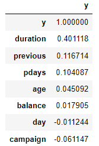
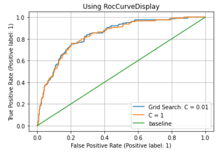
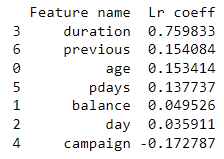
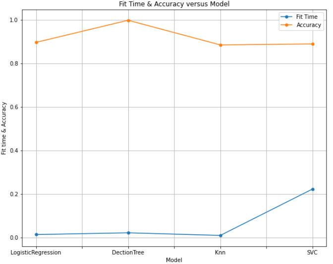

# Will the client subscribe (yes/no) to a term deposit (variable y)?

# Deliverables

The Jupyter notebook is available here:
[Jupyter Notebook](https://github.com/hossamfattah/mlmodule17/blob/64c28f208ff2a511c299d20bf35c4abc24e5c7da/MyWorkF.ipynb)

# Discussion
I read the dataset and started to explore it. I used info() to see what columns and data types is each column

 No   Column     Non-Null Count  Dtype 
---  ------     --------------  ----- 
 0   age        4521 non-null   int64 

 1   job        4521 non-null   object

 2   marital    4521 non-null   object

 3   education  4521 non-null   object

 4   default    4521 non-null   object

 5   balance    4521 non-null   int64 

 6   housing    4521 non-null   object

 7   loan       4521 non-null   object

 8   contact    4521 non-null   object

 9   day        4521 non-null   int64 

 10  month      4521 non-null   object

 11  duration   4521 non-null   int64 

 12  campaign   4521 non-null   int64 

 13  pdays      4521 non-null   int64 

 14  previous   4521 non-null   int64 

 15  poutcome   4521 non-null   object

 16  y          4521 non-null   int64 
 

This is by price:

I plotted the count plot of bank loan decision (Yes is 1 and No is 0)

I found the correlation among features and target :
Duration has the most influence on the target y and campaign is least influencer

Then I used logistic regression with best parameter C=0.01

              precision    recall  f1-score   support

       False       0.90      0.99      0.94      1006
        True       0.61      0.15      0.24       125

    accuracy                           0.90      1131

Elapsed during training: 0.01s

Accuracy score is:  0.90

And this is the Compute Receiver operating characteristic (ROC) curve: 

and I found the logistic regression coefficients for the features:

Then I used DecisionTreeClassifier with best parameter criterion='gini',max_depth = 20

              precision    recall  f1-score   support

          No       1.00      1.00      1.00      1006
         Yes       1.00      0.98      0.99       125

    accuracy                           1.00      1131

Elapsed during training: 0.02s

Accuracy score: 0.9973s

Then I used K-NeighborsClassifierssifier with best parameter n_neighbors=13

              precision    recall  f1-score   support

          No       0.90      0.98      0.94      1006
         Yes       0.43      0.14      0.22       125

    accuracy                           0.88      1131
   
Elapsed during training: 0.01s

Accuracy score: 0.8842s

Then I used supported vectors with best parameter kernel='rbf'

          No       0.89      1.00      0.94      1006
         Yes       0.00      0.00      0.00       125

    accuracy                           0.89      1131

Elapsed during training: 0.17s

Accuracy score: 0.8886s

I plotted fit time and accuracy for all ML models uses and it is as below

# Conclusions 
The classification goal is to predict if the client will subscribe (yes/no) a term deposit (variable y). 
WoW!. I found that the Decision tree classifier provides the best accuracy of 0.99 or almost 1 (i.e, it has zero error) with depth of 13.